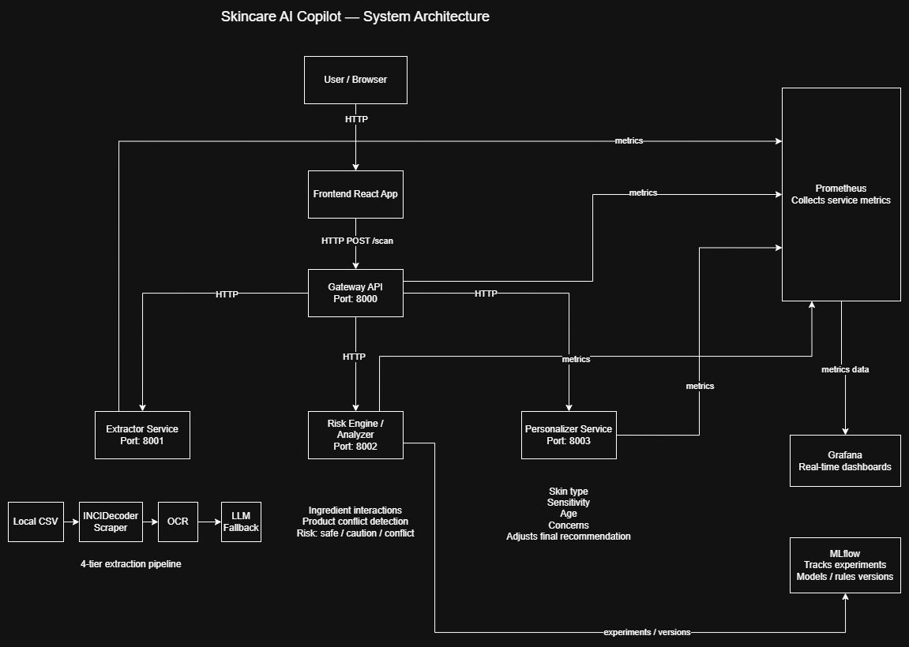
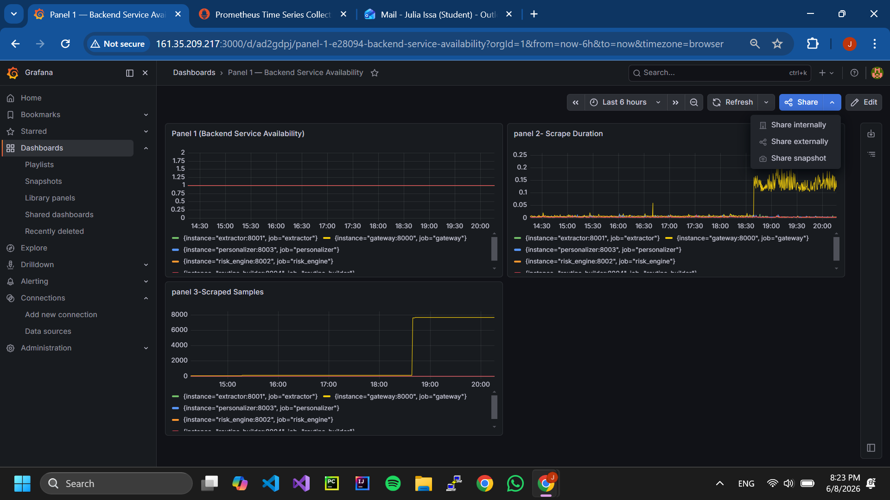
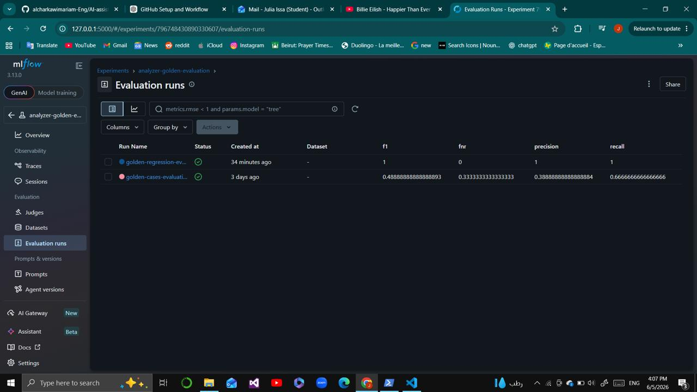

# AI Skincare Ingredient Compatibility Assistant

## Project Overview

AI Skincare Ingredient Compatibility Assistant is a production-oriented AI engineering project that helps users analyze skincare products, detect risky ingredient combinations, generate personalized skincare routines, and extract ingredients from product-label images using OCR.

The system is built as a microservice-based application with a React frontend, FastAPI Gateway, backend services, monitoring, evaluation, and deployment evidence.

## Problem Statement

Many users combine skincare products without knowing whether the ingredients are compatible or risky for their skin. Skincare labels can be difficult to understand, especially for non-expert users. Some active ingredients, such as retinol or exfoliating acids, may irritate the skin when used together.

The goal is to provide explainable recommendations that help users make safer skincare decisions.

## Goals

* Check compatibility between skincare products
* Detect risky ingredient combinations
* Explain ingredient-level concerns
* Generate personalized morning and night routines
* Extract ingredients from product-label images using OCR
* Deploy the system publicly
* Provide monitoring, testing, and evaluation evidence

## Architecture Summary

The system follows a microservice architecture:

React Frontend → FastAPI Gateway → Extractor, Risk Engine, Personalizer, Routine Builder

The Gateway is the external entry point. It receives frontend requests, validates them, and coordinates calls to the internal backend services.

## Services and Ports

| Service         | Port | Responsibility                                             |
| --------------- | ---: | ---------------------------------------------------------- |
| Frontend        |   80 | Public user interface served through Nginx                 |
| Gateway         | 8000 | External API entry point and service orchestrator          |
| Extractor       | 8001 | Extracts and normalizes product ingredients, including OCR |
| Risk Engine     | 8002 | Detects ingredient conflicts and assigns risk levels       |
| Personalizer    | 8003 | Adapts recommendations based on user profile               |
| Routine Builder | 8004 | Builds personalized skincare routines                      |
| Prometheus      | 9090 | Collects service metrics                                   |
| Grafana         | 3000 | Visualizes monitoring dashboards                           |
| MLflow          | 5000 | Tracks evaluation runs and metrics                         |

## Final API Routing Update

After the presentation, the deployed routing was improved.

The frontend no longer calls:

```text
http://161.35.209.217:8000
```

directly.

Instead, Nginx now routes frontend API calls through:

```text
/api
```

So the frontend calls:

```text
/api/scan
/api/health
/api/metrics
```

through port 80.

This avoids browser or network blocking issues caused by directly calling port 8000 from the frontend.

## Main Frontend Features

### Interaction Analysis

Allows users to compare multiple products and detect ingredient conflicts.

### Product Analyzer

Analyzes a single product and identifies possible warnings or risky ingredients.

### Ingredient Checker

Lets users check individual ingredients and understand possible concerns.

### Routine Builder

Generates personalized morning and night skincare routines based on skin type, sensitivity, age group, and concerns.

### OCR Upload

Allows users to upload a product-label image and extract ingredients automatically.

## Gateway Orchestration

The Gateway coordinates the backend workflow.

For normal product analysis:

1. The frontend sends a request to `/api/scan`.
2. Nginx routes the request internally to the Gateway.
3. The Gateway validates the request.
4. The Gateway calls the Extractor.
5. The Extractor returns recognized ingredients.
6. The Gateway calls the Risk Engine.
7. The Risk Engine detects conflicts and assigns risk.
8. The Gateway calls the Personalizer if profile information is available.
9. The final result is returned to the frontend.

For routine building:

1. The frontend sends a request with `request_type="routine_builder"`.
2. The Gateway calls the Routine Builder service.
3. The generated routine is returned to the frontend.

## OCR Flow

The OCR flow allows users to upload a skincare product-label image.

1. The frontend sends the uploaded image to `/api/extract-ocr`.
2. Nginx routes the request to the Gateway.
3. The Gateway forwards the image to the Extractor OCR endpoint.
4. The Extractor uses OCR to read text from the image.
5. The system extracts possible skincare ingredients from the OCR output.
6. The extracted ingredients are returned to the frontend.

## Rule-Based Compatibility Logic

The system uses structured compatibility rules to detect risky ingredient combinations.

Examples:

* Retinol with strong exfoliating acids may increase irritation risk.
* Sensitive skin profiles require more cautious recommendations.
* Unknown products are flagged for review.

This rule-based approach was chosen because skincare recommendations should be explainable and predictable.

## LLM Fallback

The system includes an LLM fallback for cases where local extraction methods fail.

The extraction pipeline can use:

1. Local dataset lookup
2. Ingredient normalization
3. OCR extraction
4. LLM fallback

The LLM fallback uses structured JSON output validated with Pydantic. Low-confidence results are rejected. This adds graceful degradation while keeping the system controlled and explainable.

## Local Setup

Clone the repository:

```bash
git clone <repo-url>
cd AI-assistant-for-SkinCare-ingredient-compatibility
```

Create a virtual environment:

```bash
python -m venv .venv
```

Activate it:

```bash
.venv\Scripts\activate
```

Install dependencies:

```bash
pip install -r requirements.txt
```

## Docker Compose Usage

Run the full backend stack:

```bash
docker compose up --build
```

This starts the Gateway, Extractor, Risk Engine, Personalizer, Routine Builder, Prometheus, Grafana, and MLflow.

## Deployment Setup

The final system is deployed on a DigitalOcean Ubuntu VM.

Deployment stack:

* Nginx serving the frontend on port 80
* Nginx reverse proxy routing `/api` requests to the Gateway
* Docker Compose running the backend microservices
* Prometheus for monitoring
* Grafana for dashboards
* MLflow for evaluation tracking

## Kubernetes Deliverables

The repository also includes Kubernetes deployment files for production readiness.

Kubernetes deliverables include:

* Namespace
* ConfigMap
* Deployments
* Services
* Ingress
* Secrets template
* Gateway service
* Internal service definitions

## Monitoring

### Prometheus

Prometheus is publicly accessible and scrapes all deployed backend services.

All five backend service targets were verified as UP:

* Gateway
* Extractor
* Risk Engine
* Personalizer
* Routine Builder

### Grafana

Grafana is connected to Prometheus and visualizes deployed service metrics.

Dashboard:

```text
Skincare AI Overview
```

Panels:

* Backend Service Availability
* Scrape Duration
* Scraped Samples

## MLflow Evaluation Evidence

MLflow was used to track evaluation runs and final regression evidence.

Final evaluation metrics:

| Metric    |   Value |
| --------- | ------: |
| Precision |     1.0 |
| Recall    |     1.0 |
| F1        |     1.0 |
| FNR       |     0.0 |
| Decision  | Promote |

## Testing Summary

| Test Area                          | Evidence    |
| ---------------------------------- | ----------- |
| OCR / LLM extractor tests          | 31 passed   |
| Analyzer / golden / haircare tests | 11 passed   |
| Gateway validation unit tests      | 15 passed   |
| Integration tests                  | 6 scenarios |
| E2E tests against deployed VM      | 4 scenarios |
| Frontend build                     | Passed      |
| Deployment and rubric docs         | Complete    |

## Security and Failure Modes

Security and robustness features include:

* Gateway input validation
* Product count limits
* Payload limits
* Rate limiting
* Request tracing
* Retries and timeouts
* No hardcoded secrets
* OCR upload routed through the Gateway
* Meaningful failure messages
* Unknown product handling

Failure scenarios documented include:

* Extractor failure
* Analyzer failure
* Personalizer failure
* Routine Builder failure
* Oversized payloads
* Rate limiting
* OCR upload issues

## Screenshots and Evidence

### Home Page


### Interaction Analysis


### Analysis Result


### Product Analyzer


### Ingredient Checker


### Routine Builder


### OCR Upload


### System Architecture



### Grafana Monitoring Dashboard




### MLflow Evaluation



## Final Demo URLs

| Service          | URL                            |
| ---------------- | ------------------------------ |
| Frontend         | http://161.35.209.217          |
| Gateway API Docs | http://161.35.209.217/api/docs |
| Prometheus       | http://161.35.209.217:9090     |
| Grafana          | http://161.35.209.217:3000     |
| MLflow           | http://161.35.209.217:5000     |

## Final Deployment Status

The final deployment is live and operational.

The frontend is publicly accessible through Nginx on port 80. API calls are routed through `/api`, which forwards requests internally to the Gateway. The backend microservices are running through Docker Compose, and monitoring/evaluation services are available through Prometheus, Grafana, and MLflow.

The final system supports:

* Product compatibility analysis
* Product analysis
* Ingredient checking
* Routine building
* OCR ingredient extraction
* Monitoring
* Evaluation tracking
* Deployment evidence
