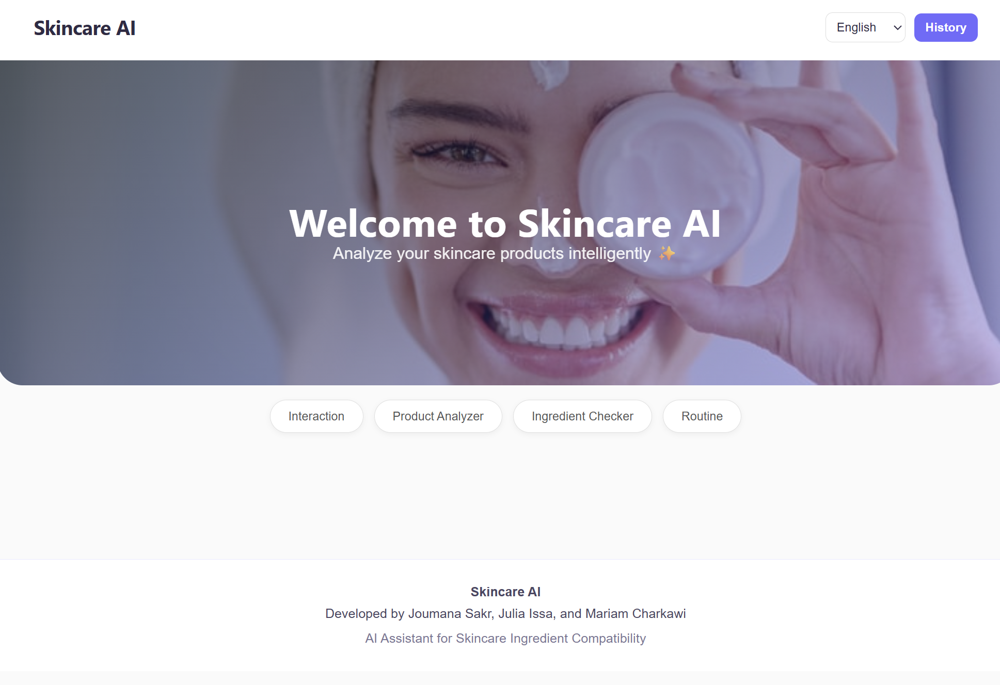
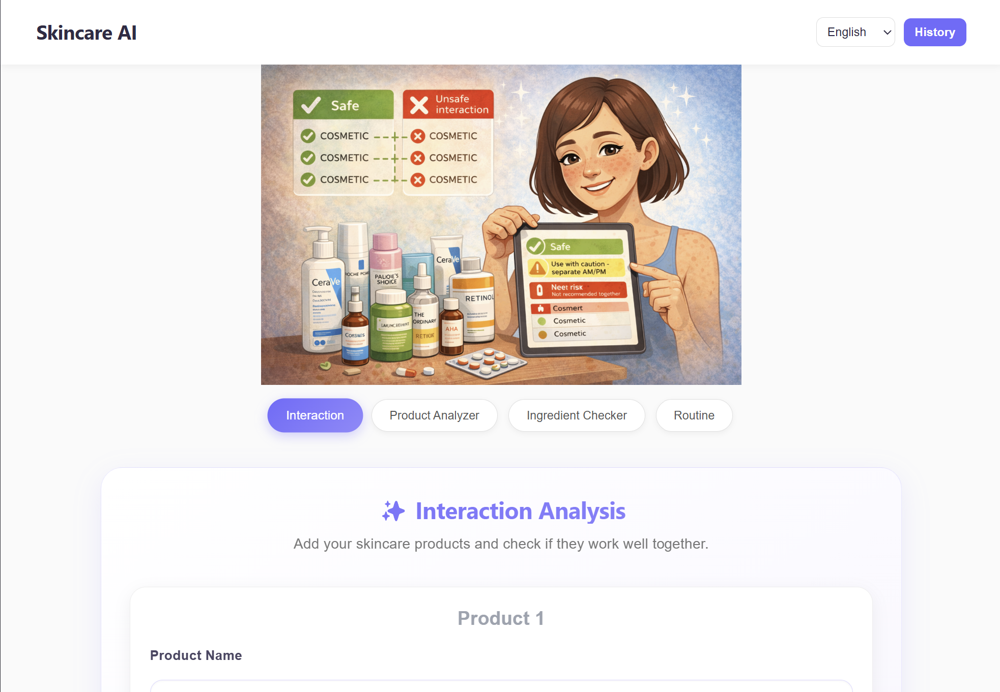
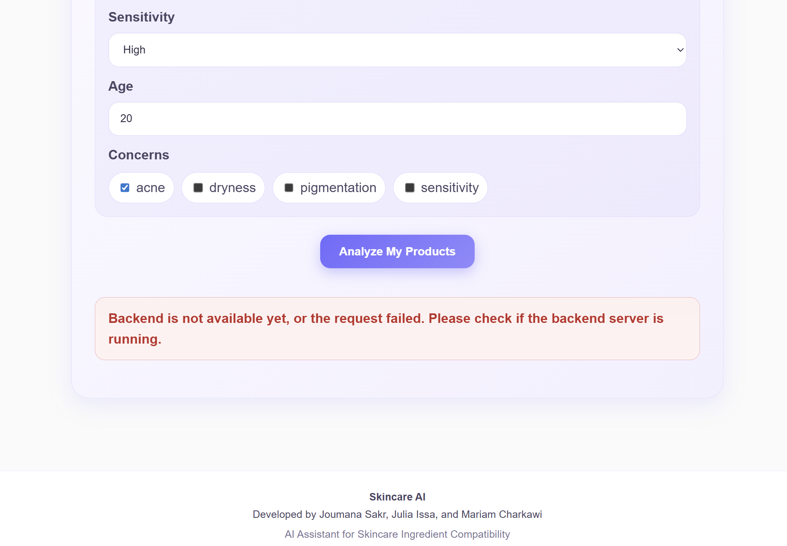
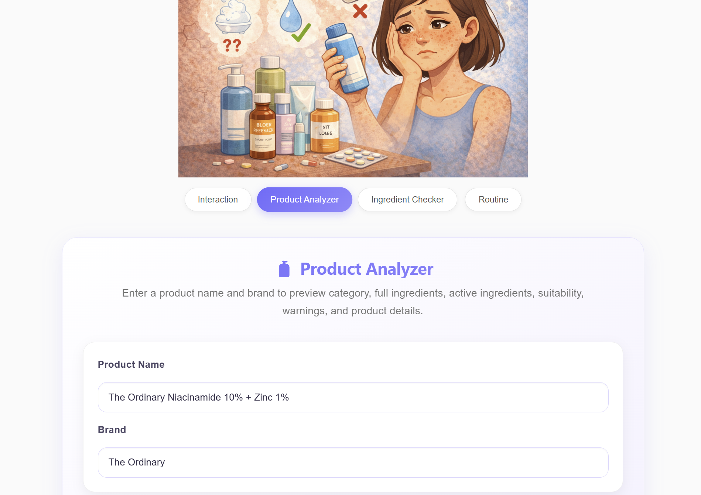
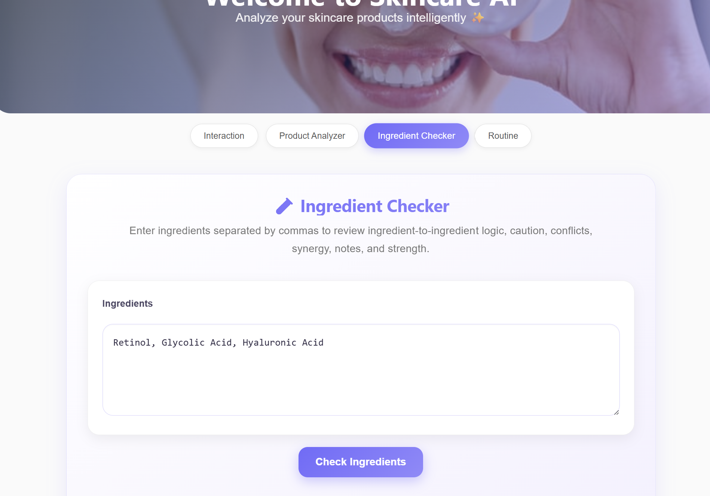
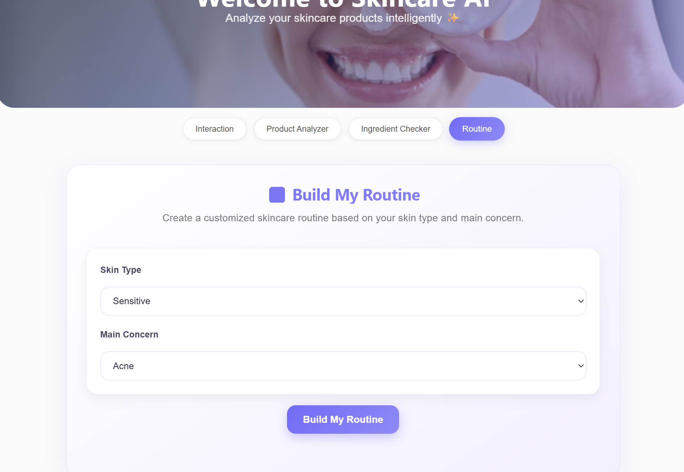
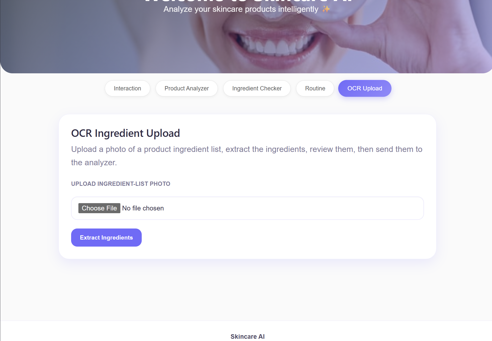

# User Guide - Skincare AI Copilot

## Overview

Skincare AI Copilot helps users analyze skincare products, check ingredient compatibility, build a routine, and review product interaction risks based on the user profile.

This guide explains how to use the system step by step.

## Before You Start

Make sure the frontend is running locally.

```powershell
cd apps\gateway\frontend
npm install
npm run dev
```

Then open the local Vite URL in the browser, usually:

```text
http://localhost:5173/
```

## Main Features

The application includes the following sections:

1. Interaction Analysis
2. Product Analyzer
3. Ingredient Checker
4. Routine Builder
5. OCR Upload
6. Analysis History

## Screenshots Included

The screenshots used in this guide are saved in:

```text
docs/user-guide-assets/
```

Included screenshots:

1. `01-home.png` — home page and main navigation
2. `02-interaction-analysis.png` — interaction analysis form
3. `03-analysis-result.png` — backend unavailable / analysis error state
4. `04-product-analyzer.png` — product analyzer screen
5. `05-ingredient-checker.png` — ingredient checker screen
6. `06-routine-builder.png` — routine builder screen
7. `07-ocr-upload.png` — OCR upload screen

## 1. Home Page and Navigation

Screenshot:



When the user opens the application, they see the Skincare AI Copilot home page with the main navigation tabs. Each tab opens a different feature of the system.

The top bar includes the language selector and the History button.

## 2. Interaction Analysis

Screenshot:



Use this section to check whether two or more skincare products are compatible.

Steps:

1. Open the **Interaction** tab.
2. Enter at least two product names.
3. Enter the brand if available.
4. Select the skin type.
5. Fill the user profile fields if needed, such as sensitivity, age, and concerns.
6. Click **Analyze My Products**.

The system sends the products and user profile to the backend `/scan` endpoint.

## 3. Viewing an Analysis Result or Error State

Screenshot:



After the scan finishes, the app displays the result. The result may include the risk level, explanation, recommendations, and unknown products if the backend could not identify a product.

If the backend is not running, the app shows a clear error message instead of crashing. This helps the user understand that the frontend is working, but the backend service is unreachable.

## 4. Product Analyzer

Screenshot:



Use this section to analyze one product.

Steps:

1. Open the **Product Analyzer** tab.
2. Enter the product name.
3. Enter the brand if available.
4. Click **Analyze Product**.

The system sends the product to the backend and displays product details when available.

## 5. Ingredient Checker

Screenshot:



Use this section to check a list of ingredients directly.

Steps:

1. Open the **Ingredient Checker** tab.
2. Enter ingredients separated by commas.
3. Click **Check Ingredients**.

The app sends the ingredient list to the backend and displays warnings, conflicts, notes, or recommendations.

## 6. Routine Builder

Screenshot:



Use this section to build a simple skincare routine based on the user profile.

Steps:

1. Open the **Routine** tab.
2. Select the skin type.
3. Select or enter the main skin concern.
4. Click the routine builder button.

The app uses the selected profile information to generate a suggested routine.

## 7. OCR Upload

Screenshot:



Use this section to upload a photo of a product ingredient list.

Steps:

1. Open the **OCR Upload** tab.
2. Choose an image from the device.
3. Check that the image preview appears.
4. Click **Extract Ingredients**.
5. Review and edit the extracted ingredients.
6. Click **Send to Analyzer**.

The `/extract-ocr` backend endpoint must be running for extraction to work. If the backend is not ready yet, the OCR tab will still show image upload and preview, but extraction will fail with a backend-unavailable message.

## 8. Analysis History

The **History** button shows analyses saved locally in the browser. This helps the user quickly review recent scans.

The history is stored locally and can be cleared using the **Clear History** button.

## Troubleshooting

### Backend unreachable

If the app shows a backend error, make sure the backend services are running and that the frontend is sending requests to the correct backend port.

### OCR extraction does not work

Make sure the `/extract-ocr` endpoint is available. If the backend is not ready yet, the OCR tab will still show image upload and preview, but extraction will fail with a backend-unavailable message.

### Product not found

If a product is not found, try entering a clearer product name or adding the brand name.

### Page does not update

Refresh the browser and check the terminal for frontend errors.

### Screenshot is missing in the guide

Make sure the screenshot file exists inside:

```text
docs/user-guide-assets/
```

Also make sure the file name matches the image link in this document.